## Hello 👋

### GitHub Stats

### 仓库状态

- [txt-sql](https://github.com/CrispyXYZ/txt-sql) - 持续长期开发的 Python 项目，活跃
- [wangran](https://github.com/CrispyXYZ/wangran) - 基于 SSM 的 JavaWeb 后端应用程序，短期活跃开发
- [yearn-lang](https://github.com/CrispyXYZ/yearn-lang) - C++ 写的自制语言解释器，暂时搁置
- [GeneticChickengineering-CN-RC30-Extended](https://github.com/CrispyXYZ/GeneticChickengineering-CN-RC30-Extended) - Java 写的 MC Slimefun4 附属插件（汉化并增强版），有限维护
- [JvavScript](https://github.com/CrispyXYZ/JvavScript) - 第一个仓库 ~~（码风💩中💩）~~ ，早期的探索，已弃坑
- 其它项目 - 写着玩的，基本全都是弃坑状态
